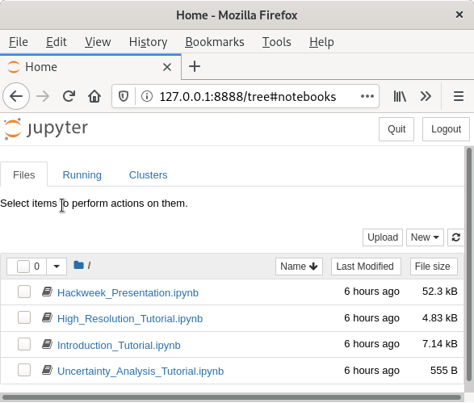

# ICESat-2 Surface Velocity

Surface ice velocity from repeat passes using the across slope between beams and the slope between points on the same track. Cross overs could also be used. Which product?, maybe ATL06 or ATL03. It should be interesting to compare different areas (e.g. Antarctica, Greenland, Patagonia). Surface ice velocity from laser altimetry  has been done with ICESat 1 over the Ross Ice Shelf. The smaller footprint could improve the accuracy and the precise repeat passes could account for seasonality over certain regions.

This project was started at the 2020 ICESat-2 hackweek. The idea is that repeat altimetry can be used to infer ice velocity by correlating the surface slopes between acquisitions. The idea is based on similar work with the ICESat-1 GLAS altimeter (Marsh and Rack, 2010).

#  how to run

- build with [build script](./build.sh)
- run with [run script](./run.sh)
- open the URL displayed from the container:
```bash
$ run.sh
[I 15:42:57.743 NotebookApp] JupyterLab extension loaded from /usr/local/lib/python3.7/site-packages/jupyterlab
[I 15:42:57.743 NotebookApp] JupyterLab application directory is /usr/local/share/jupyter/lab
[I 15:42:57.746 NotebookApp] Serving notebooks from local directory: /root/repo/notebooks
[I 15:42:57.746 NotebookApp] Jupyter Notebook 6.1.4 is running at:
[I 15:42:57.746 NotebookApp] http://98af56175c04:8888/?token=XXXXXX
[I 15:42:57.746 NotebookApp]  or http://127.0.0.1:8888/?token=XXXXXX
[I 15:42:57.746 NotebookApp] Use Control-C to stop this server and shut down all kernels (twice to skip confirmation).
[W 15:42:57.750 NotebookApp] No web browser found: could not locate runnable browser.
[C 15:42:57.750 NotebookApp]

    To access the notebook, open this file in a browser:
        file:///root/.local/share/jupyter/runtime/nbserver-30-open.html
    Or copy and paste one of these URLs:
        http://XXXXXXX:8888/?token=XXXXX
     or http://127.0.0.1:8888/?token=XXXXXX
```
- take the 127.0.0.1 one
- see the result like 

# References
- Marsh, O.J., Rack, W., 2010. A method of calculating ice-shelf surface velocity using ICESat altimetry. J. Geophys. Res. Earth Surf. 115, 25–30. https://doi.org/10.1029/2009JF001311

